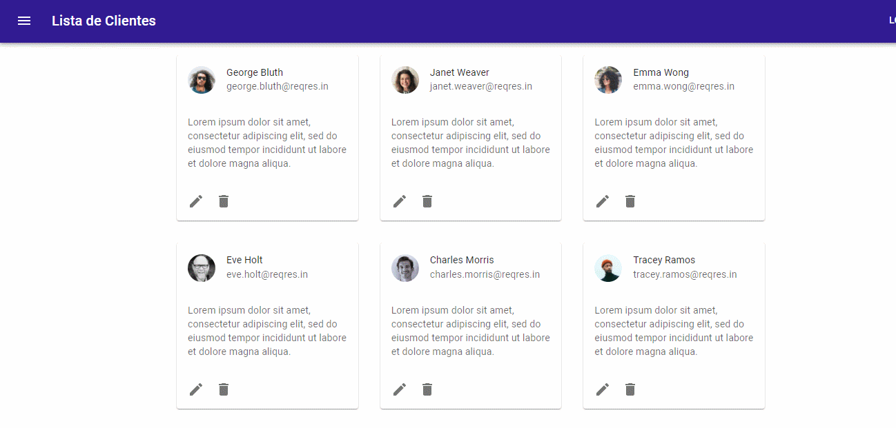

<div align="center" id="top"> 
  

  &#xa0;

  <a href="https://listadeclientes.vercel.app/">Demo</a>
</div>

<h1 align="center">Lista De Clientes</h1>

<p align="center">
  

  

  

  <!--  -->

  <!--  -->

  <!--  -->
</p>

<!-- Status -->

<!-- <h4 align="center"> 
	🚧  Lista De Clientes 🚀 Em construção...  🚧
</h4> 

<hr> -->

<p align="center">
  <a href="#dart-sobre">Sobre</a> &#xa0; | &#xa0;
  <a href="#sparkles-funcionalidades">Funcionalidades</a> &#xa0; | &#xa0;
  <a href="#rocket-tecnologias">Tecnologias</a> &#xa0; | &#xa0;
  <a href="#white_check_mark-pré-requisitos">Pré requisitos</a> &#xa0; | &#xa0;
  <a href="#checkered_flag-começando">Começando</a> &#xa0; | &#xa0;
  <a href="https://github.com/idomelo" target="_blank">Autor</a>
</p>

<br>

## :dart: Sobre ##

Aplicação Feita em React e Material UI que faz request de uma lista de usuários para API Rest.
Os dados são exibidos e é possível simular edição e registro de clientes. A API não permite uma edição real, portanto, é possível somente visualizar os dados enviados e a resposta dela.

## :sparkles: Funcionalidades ##

:heavy_check_mark: Request de dados para API Real;\
:heavy_check_mark: Componentes do Material UI;\
:heavy_check_mark: Navegação entre Rotas;\
:heavy_check_mark: Request via Axios;

## :rocket: Tecnologias ##

As seguintes ferramentas foram usadas na construção do projeto:

- [React v17.0.2](https://pt-br.reactjs.org/)
- [Material UI v5.4.2](https://mui.com/)
- [React Router v6.2.1](https://reactrouter.com/)
- [axios v0.26.0](https://expo.io/)
- [reqres API fake](https://reqres.in/)


## :white_check_mark: Pré requisitos ##

Antes de começar :checkered_flag:, você precisa ter o [Git](https://git-scm.com) e o [Node](https://nodejs.org/en/) instalados em sua maquina.

## :checkered_flag: Começando ##

```bash
# Clone este repositório
$ git clone https://github.com/idomelo/lista-de-clientes

# Entre na pasta
$ cd lista-de-clientes

# Instale as dependências
$ npm i axios react-router-dom 
@mui/material
@emotion/react
@emotion/styled
@mui/icons-material

# Para iniciar o projeto
$ npm start

# O app vai inicializar em <http://localhost:3000>
```

Feito com :heart: por <a href="https://github.com/idomelo" target="_blank">Ido Melo</a>

&#xa0;

<a href="#top">Voltar para o topo</a>
